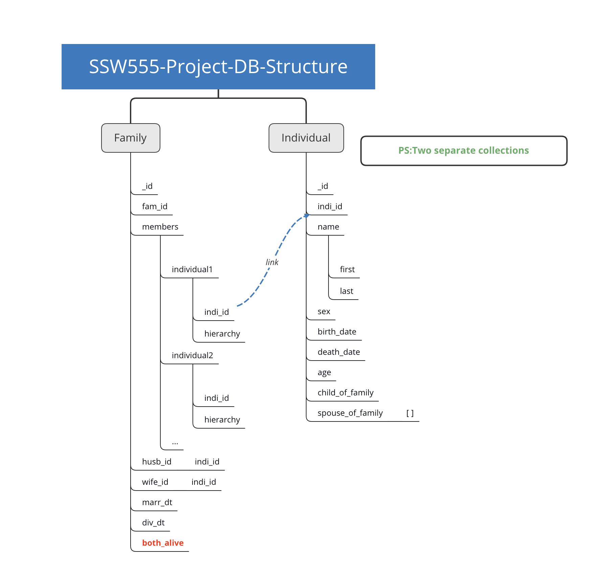

# SSW555 TeamAJRY: GEDCOM CLI

This is a project for the SSW555 of Stevens Institute of Technology taught by geekiest professor Jim Rowland.

---

- **Team Member**:

  - Yinghui Cai(Benji)
  - Rahil Patel(Ray)
  - Aniruddha Pimple(John)
  - Jiahua Zhou(Javer)

- **User stories for sprint 4**:

|Story ID|Story Name|Owner|
|:---:|:---:|:---:|
|US32|List multiple births|Ray|
|US34|List large age differences|John|
|US35|List recent births|Javer|
|US36|List recent deaths|Javer|
|US37|List recent survivors|John|
|US39|List upcoming anniversaries|Ray|
|US40|Include input line numbers|Benji|
|US42|Reject illegitimate dates|Benji|

---

## 0. Table of Content

1. [Lastest Change of the Code](#1-lastest-change-of-the-code)
2. [Installation & PyPI](#2-installation--pypi)
3. [Workflow of Version Control](#3-workflow-of-version-control)
4. [Project Overview Link](doc/Project_overview.md)
5. [Coding Style Guideline](doc/coding_style_specification.md)

## 1 Lastest Change of the Code

Major changes happens in the `gedcom_ajry.py` for sure, as well as newly added test cases. But more importantly, we have modified the Command Line Interface. Basically we have `gedcom` as a group command and includes the list utilities which are seperated from `detect`.

```shell
$ gedcom
Usage: gedcom [OPTIONS] COMMAND [ARGS]...

  Command line interface for SSW 555 GEDCOM file analyzer

Options:
  --help  Show this message and exit.

Commands:
  detect  Pretty print the individuals and family tables and detect errors...
  us28    US28: Order Siblings by age
  us29    US29: List deceased people
  us31    US31: List living single
  us33    US33: List orphan
```


## 2 Installation & PyPI

We havn't update the [package on PyPI](https://pypi.org/project/GEDCOM-Benji/) for a while as it takes more effort than we thought for the update of product attributes. However you can use a `-e` or `--editable` option in `pip3` command to install a editable version of package in your environment. With `--editable` option, the functionality of the command line will change along with the change of code.

```sh
pip3 install --editable .
```

Note that it's required to use the dot(`.`) to represent the current directory instead of use the package name.

## 3 Workflow of Version control

1. On the GitHub repository webpage, create your own branch with the name pattern `sprint2_initial` (e.g. `sprint2_benji`) based on branch `sprint2`

2. Go to the command line and pull down your own branch with following steps, with the example of branch `sprint2_benji`:
    1. `git checkout sprint2_benji`
    2. `git pull --all`

3. Develop your user stories, test cases on your branch and push it on your own branch. I will do the merging carefully after you push the branch.

## 4 MongoDB Storage Data Structure



## 5 Project Overview

***We are using a MVC architecture for our project.***

To keep the README nice and clean, we have the *project overview* and *random ideas list* wrapped up in another [file](doc/Project_overview.md). Feel free to check it out!

## 6 Coding Style Specification

Please see the [file](doc/coding_style_specification.md) for the naming pattern suggestions.
